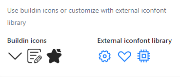
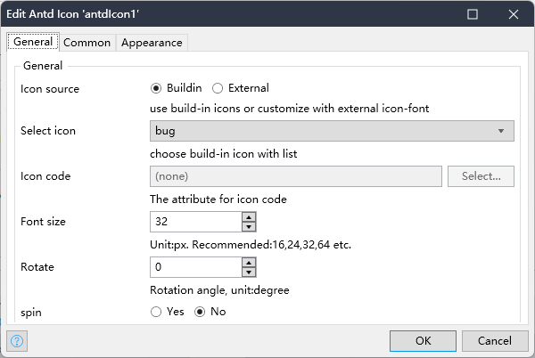
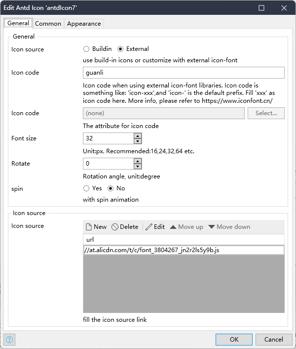

[中文版](https://github.com/wiwengweng/mendix-antd-icon/blob/master/README-CN.md)
## Introduction

A Mendix Widget widget implemented based on Ant Design. The widget implements most of the interfaces of [`icon`](https://ant.design/components/icon) in Ant Design (antd). You can go [here](https://ant.design/components/icon) to see various features of the original antd component.

View features of this project on [online demo](https://demo-antdwidgets100.apps.ap-2a.mendixcloud.com/).

## Features

1. Support two types of resources, including: `buildin` and `external iconfont`.
2. Support static definition or dynamic iconfont with data source.
4. Support other Ant Design icon API configuration

## Quick start

1. Add the widget to Mendix Project.
    1. Download the latest mpk file from [here](https://github.com/wiwengweng/mendix-antd-icon/releases/).
    3. Copy the mpk file to your Mendix Project directory `{YourMendixProjectFolder}/widgets/`.
    4. Open your Mendix Project with Mendix Studio Pro, then click the menu `Menu > App > Synchronize App Directory`.
2. Use `Antd Icon`.
    1. Select any page and search `Antd Icon` from the Toolbox in Mendix Studio Pro.
    2. Add an `Antd Icon` widget to the page.
    3. Set properties for the widget. Double-click the widget and follow the settings:
        1. Select `Buildin` from data source;
        2. Select an icon from the `Select icon` dropdown list
        3. Have fun!

## Demo project

1. You can access the online demo from [here](https://demo-antdwidgets100.apps.ap-2a.mendixcloud.com/) to show the features of this widget.   
2. You can also download the demo project from [here](https://github.com/zjh1943/mendx-antd-widgets-show) to run it on your own PC.
    

## Detailed configuration instructions

### General

The General tab contains most of the common configuration options

* Icon source - Support buildin icons and use external iconfont.
* Select icon - 50+ buildin icons for users
* Icon code - Specify data attribute to retrive icon name
* Rotate - Support icon rotate
* Spin - Support icon spin animation

External icons

you can use iconfont to customize the icons

add a iconfont library to the `Icon source`, and fill in the `Icon code`

p.s. There are some restricts within Ant Design Icon with iconfont. Iconfonts are named after `icon-`. e.g: `icon-wrong-b`. We shall fill in the `Icon code` with the 2nd part `wrong-b`.

## Functional comparison with `antd` Icon

This lists all the parameters of `Icon` in `antd`, and explains whether the widget supports this APIs, and why without support(eventually developers can DIY). If you want to learn more of the original APIs in `antd`, please [check this out](https://ant.design/components/icon).

## Issues, suggestions and feature requests
[Github Issue](https://github.com/wiwengweng/mendix-antd-icon/issues)

At the same time, your are welcome to get into the China Technology Forum to get more in Mendix widget development. [check this out](https://marketplace.siemens.com.cn/low-code-community)

## Local development and contributions

1. Clone the project locally and install dependencies with `npm install`. If the npm version is v7.x.x, (users can use `npm -v` to check the version), use the following command to install dependencies: `npm install --legacy- peer-deps`.
2. Run npm start in the command line to start bundle the widget:
    * Project started bundling...
    * Wait for the dinner, and the widget will be automatically generated in the dist directory;
    * Developers can modify the package.json, and specify the test project of Mendix. When your dinner is ready, the widget will be automatically synchronized to the `deployment` and `widgets` directories.